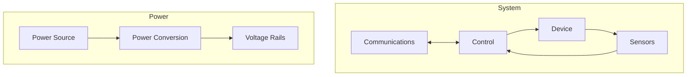
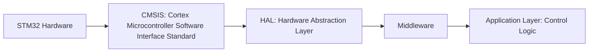
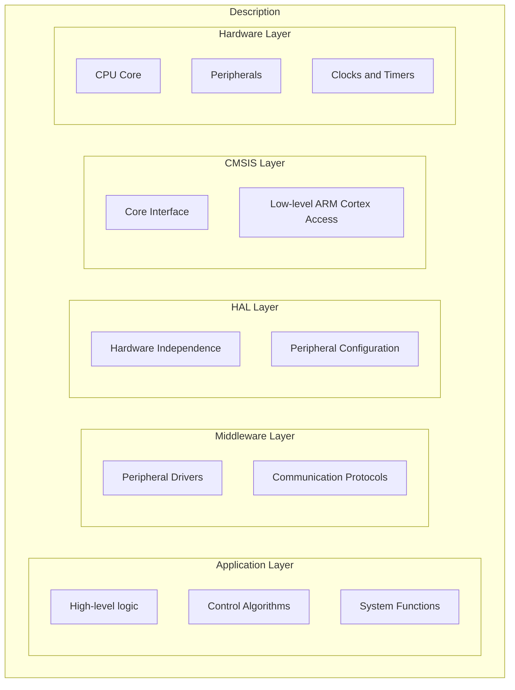

# Chapter 1: Electronic Systems Basics

Electronic systems are at the core of modern technology, embedded in everything from household appliances to industrial machines. These systems consist of several key components, each with its own role in the overall functionality. This chapter introduces the essential building blocks of an electronic system, including communication, control, devices, sensors, and power management.

## Key Components of an Embedded System

### 1. Communications & Control

Communication and control are the "brain" of an electronic system, allowing it to interact with its environment and make decisions based on incoming data.

#### Communications
- **Purpose**: Facilitates data exchange between components or with external systems.
- **Examples**: Internet of Things (IoT) devices, RF (radio frequency) communication, Bluetooth, and CAN bus for automotive systems.

#### Control
- **Purpose**: The control unit, often a microcontroller or processor, makes decisions based on inputs from sensors and communicates these decisions to other system components, like motors or displays.
- **Examples**: Microcontrollers such as STM32, ESP32, and various embedded processors.

### 2. Devices & Sensors

#### Devices
Devices are the components that interact with the physical world by converting electrical signals into mechanical action or other physical outputs.
- **Examples**: 
  - **Motors**: Convert electrical energy into rotary motion (e.g., DC motors, servo motors).
  - **Relays and Actuators**: Devices that enable switching or mechanical movement.
  - **Electromechanical Devices**: Used in systems like robotic arms, conveyor belts, or even household appliances.

#### Sensors
Sensors are crucial for gathering real-time data from the environment, which the control system uses to adapt and respond dynamically.
- **Examples**:
  - **Temperature Sensors**: Measure environmental heat.
  - **Light Sensors**: Detect the intensity of light or infrared signals.
  - **Motion Sensors**: Detect movement, acceleration, or orientation.

### 3. Power

Without power, no system can function. Power systems in embedded devices typically consist of a power source and the necessary conversion circuitry to provide the correct voltage levels for different components.

#### Power Sources
- **Batteries**: Common in portable or low-power devices.
- **Solar Panels**: Used in energy-efficient or renewable energy systems.
- **AC Mains**: Provides high power for industrial systems or stationary electronics.

#### Power Conversion
Power conversion is necessary to convert raw input power (e.g., from a battery or AC mains) into stable, usable voltage levels required by the system components.
- **Examples**:
  - **DC/DC Converters**: Convert one DC voltage level to another.
  - **Voltage Regulators**: Ensure a stable voltage supply for sensitive components.
  - **Rectification**: Converts AC power to DC power, often used when sourcing from mains electricity.

### 4. Feedback Systems

A crucial aspect of many embedded systems is the concept of **feedback loops**, where data from sensors is used to adjust the system’s operations. Feedback improves both the **efficiency** and **reliability** of a system by allowing it to adapt to changing conditions.

- **Example**: A thermostat that measures room temperature and adjusts a heater or cooler based on the desired temperature.
  
- **Control Loops**: Continuous feedback loops allow systems to stay within optimal parameters by making real-time adjustments based on sensor data.

## Software in Embedded Systems

Software drives the behavior of embedded systems. It interprets data from sensors, controls devices, and manages the flow of communication and power. There are typically multiple layers in an embedded system’s software stack, from low-level hardware control to high-level application logic.

### Software Layers

#### Hardware Layer
This is the physical hardware layer, which includes the microcontroller, processors, peripherals (timers, UART, SPI), and memory.

#### CMSIS (Cortex Microcontroller Software Interface Standard)
CMSIS is a hardware abstraction layer for ARM Cortex-based microcontrollers. It provides a unified interface for low-level core functionality, such as handling interrupts or system tick timers.

#### HAL (Hardware Abstraction Layer)
The HAL provides a high-level API that abstracts the hardware details, allowing developers to work with various peripherals (like GPIOs, ADCs, I2C) without needing to understand the specific registers or configuration of the microcontroller.

#### Middleware
Middleware sits between the HAL and the application layer, providing higher-level libraries and frameworks for tasks such as file systems, communication stacks (e.g., USB, Ethernet), and other device-specific drivers.

#### Application Layer
This is where the main control logic and functionality of the system are implemented. The application layer manages system tasks, makes decisions based on sensor inputs, and sends commands to actuators or other devices.

## Conclusion

Embedded systems are an intricate combination of hardware and software, with each component working together to achieve the desired functionality. From communications and control to devices, sensors, and power, understanding how these components interact is critical to designing and developing effective embedded solutions. The software stack, from CMSIS to the application layer, provides the tools needed to manage these interactions and ensure the system performs reliably in real-world conditions.

---

This chapter serves as a high-level overview of the essential components of an electronic system, preparing readers for deeper exploration into specific areas in the following chapters.
