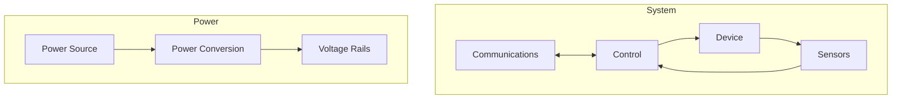
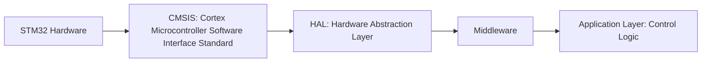
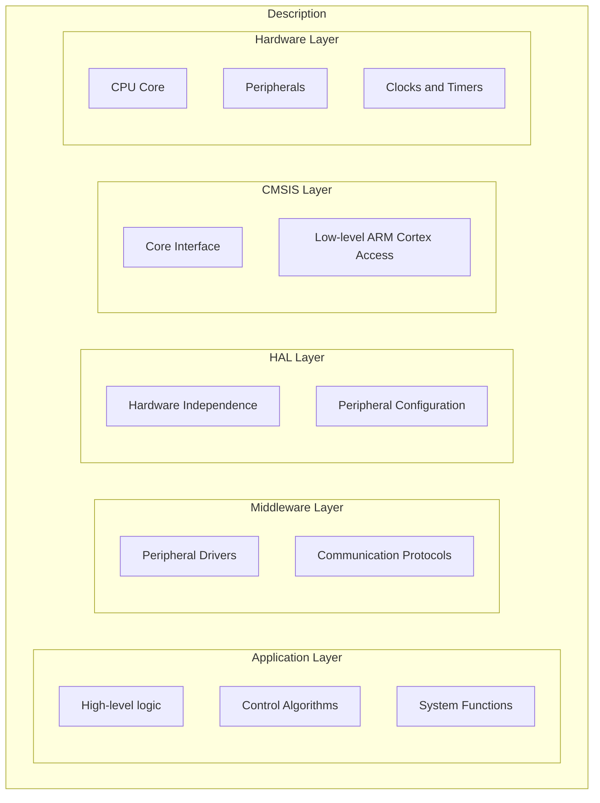

# Chapter 1: Electronic Systems Basics

Electronic systems are everywhere, from simple appliances to complex machines. Key components:

1. Communications
2. Control
3. Devices
4. Sensors
5. Power

## Communications & Control

- Communications: Data exchange (IoT, RF)
- Control: Decision-making (microcontrollers, processors)

## Devices & Sensors

- Devices: Convert electrical to mechanical (motors, relays)
- Sensors: Measure environment (temperature, light, motion)

## Power

- Sources: Batteries, solar, AC mains
- Conversion: DC/DC, regulators, rectification

## Feedback Systems

Sensors provide data for adaptive control, improving efficiency and reliability.

## Software

- Programming microcontrollers
- Operating systems
- Application software

